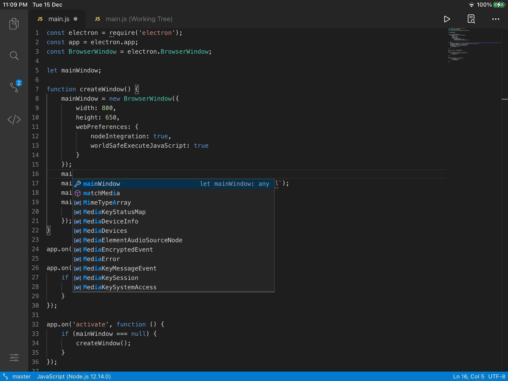
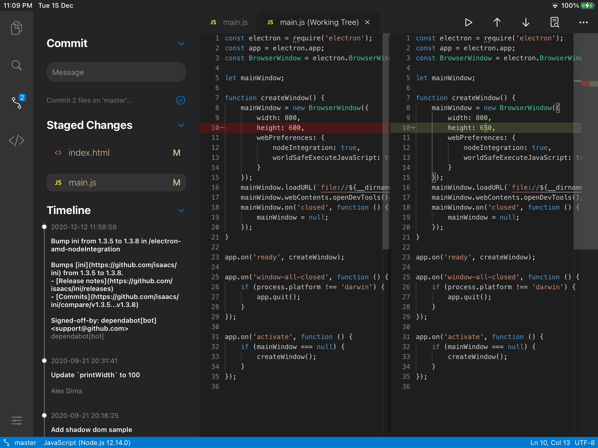

# Code App
Bringing desktop-like editing expereince to iPad, available on App Store: https://apps.apple.com/us/app/code-app/id1512938504

## About the repositroy
This repository does not contain any source code for the app. Instead, we work on issues, listen to your feedback and publish our development plan here.

## The Plan
Use [VS Code](https://github.com/microsoft/vscode) as a design template while providing key functionalities with native code:
- Version Control (Git clone, commits, diff editor, push, pull and merge) ✅
- Embeded terminal (70+ Linux commands avaliable) ✅
- Built in Python runtime 🏃
- C/C++ Runtime with Emscripten (WebAssembly) 🏃
- Local web development environment (Node) 🏃
- [LSP](https://microsoft.github.io/language-server-protocol) support 🏃

## What we've achieved
- Monaco Editor integration, with Intellisence for HTML, Javascript, JSON, TypeScript 

- Support for Version Control (Git clone, commits, diff editor, push, merge (partial), and pull) 

- Built-in Terminal (70+ Linux commands avaliable)
%20(4th%20generation)%20-%202021-01-01%20at%2017.37.49.png)
- Server-side multi-file compiling for 40+ languages
- Markdown file preview
- Built in web server
- Files App Integration
