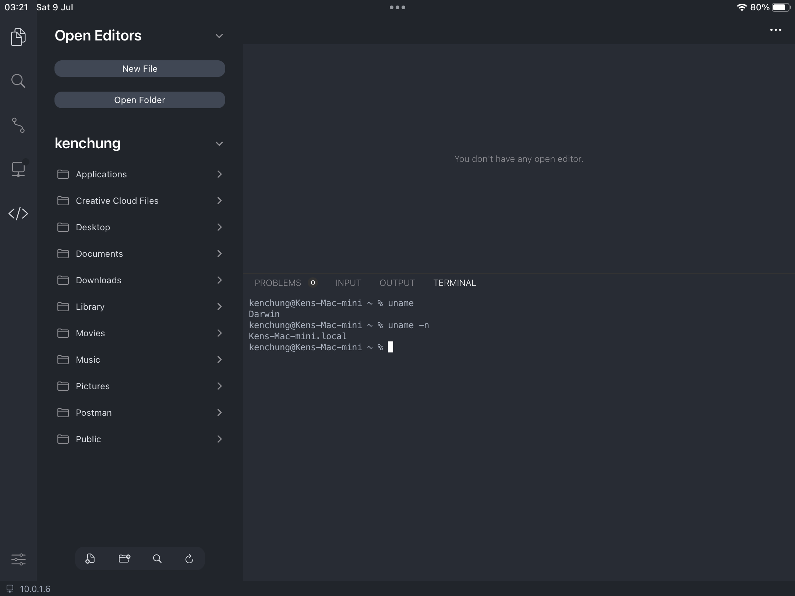

# Getting familiar

<figure><figcaption></figcaption></figure>

## Files and Documents

### Workspace

A workspace is the root folder of the editor. It defines the files and folders displayed in the file explorer, as well as the working directory of the built-in terminal.

The default workspace folder is set as Code's Documents folder, which can be access in the Files App  `On My iPad > Code`. To set it as an other directory, tap the open folder icon in explorer (folder with a gear) and select any folder from Files App, including iCloud directories. Alternatively, tap and hold the folder's name and select `Assign as workspace folder`.


To access files from OneDrive or other cloud providers, you might need to use the open file option instead, due to the platform's limitation.


To exit a workspace folder, select Close workspace in the quick menu at the top right corner.

### Creating files and folders

To create files and folder at the root folder, tap on the corresponding icon in the file explorer. To create files or folders in subfolders, tap and hold their names and select the relevant options.

### Importing a external project

Use the source control feature to clone your projects or explore community-maintained template projects for Code App. To learn more:


[version-control.md](version-control.md)


### Access files from a SSH / FTP remote

You can access files hosted on a remote machine using Code App. To learn more:


[connecting-to-a-remote-server-ssh-ftp.md](connecting-to-a-remote-server-ssh-ftp.md)


## Languages

### Executing a program

Code App shows a play button at the top right corner for supported languages. Tap to execute the program. For languages that requires remote execution, the play button is shown along a server icon.

<figure><figcaption></figcaption></figure>

To use custom compile flags, directly enter the command in the terminal. Supported commands include `java`, `javac`, `clang`, `clang++`, `python`, `node`, `php` etc.


[your-first-program-in-python.md](your-first-program-in-python.md)



[creating-a-node.js-project.md](creating-a-node.js-project.md)


## Editor

### Saving a file

Code App automatically saves your file when you hide the keyboard or exit the app.

### Switching between Monaco Editor and Runestone editor

<figure><figcaption>
Native text selection using Runestone editor
</figcaption></figure>

You may notice the default editor (Monaco) does not support native text selection using touch controls. Consider switching to Runestone editor mode when you are using the app without a physical keyboard. To do this, select switch to editor in the quick menu at the top right corner.&#x20;

